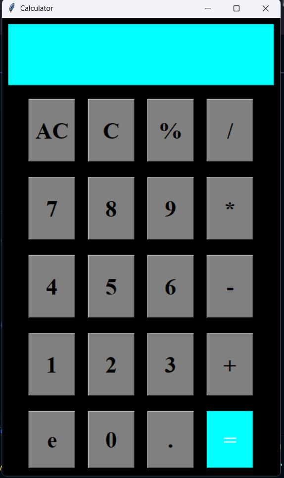

# Python GUI Calculator

This repository contains a GUI-based calculator built with Python and Tkinter.  
The calculator performs basic arithmetic operations (addition, subtraction, multiplication, and division) and includes features such as clearing entries and displaying results.

## Features

- User-friendly graphical interface using Tkinter
- Basic operations: addition, subtraction, multiplication, division
- Clear and backspace functionalities
- Real-time result display

## Getting Started

1. **Clone the repository:**
   ```bash
   git clone https://github.com/shubha-pandey/Calculator.git
   cd Calculator
   ```

2. **Run the calculator:**
   ```bash
   python Calculator.py
   ```

## Screenshots

> **Tip:** Upload your screenshots to the repository (e.g., in a folder named `screenshots`) and update the image links below.



## Requirements

- Python 3.x

No additional dependencies are needed as Tkinter is included with Python's standard library.

## License

This project is open source and available under the [MIT License](LICENSE).

---

Happy calculating!
